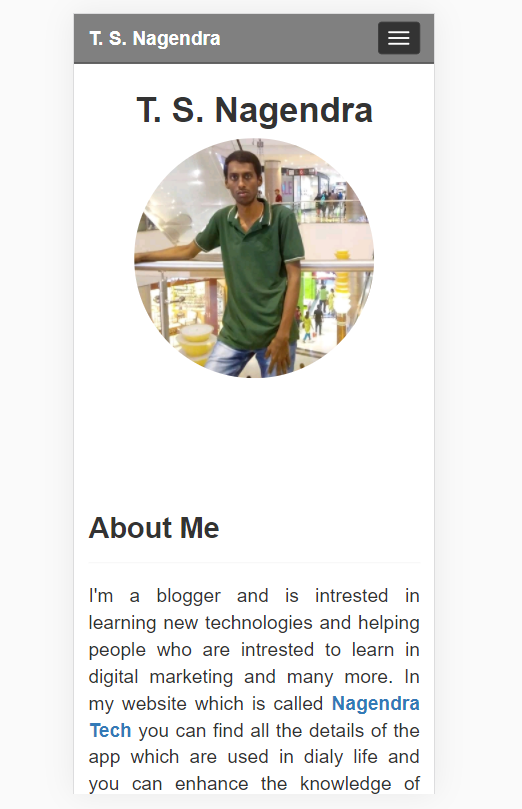

# Building Nagendra's Portfolio from scratch.

## Introduction

 So long story short, Nagendra is my friend from Bengaluru, India. So he is a practicing computer science since he didn’t have a portfolio, I suggested him one, rather than using word press or any lazy approach to build a website, I gave him an offer of building one simple website for free just for himself. Now building websites from scratch is my passion. After watching the movie <b>“Kong: The Skull Island”</b>, on <b>Friday 27, Nov, 2020</b> I started building the website from scratch. I challenged myself to build this website within <b>6 hours</b>, but couldn’t meet up and finished it in <b>6 hours 31 minutes</b>. Nevermind I'm happy anyways. This website speaks about Nagendra’s life, academics, publications, projects, etc. I have documented the code very and made it user friendly so in the future in my absence with minimal knowledge on web programming he can update the website on his own.

## Responsive Website

 https://tanu-n-prabhu.github.io/Nagendra/index.html
